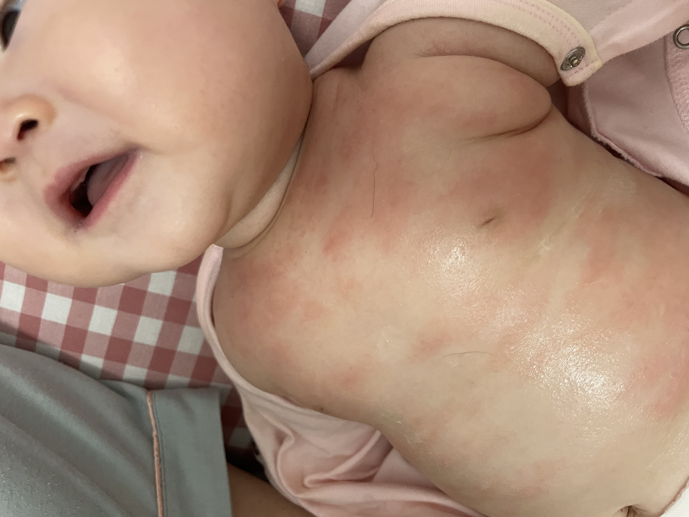

tags::  #p1-🫐seed-种子, #s3-★★★☆☆,  #[[FAQ]]
created:: [[Dec 31st, 2024]] 
public:: false
iteration::

- ## 症状
	- 肚脐以上到脖子有红斑、红点、痒
	- 
	- 
- ## 发生时间
	- 12.24: 第一次泛红，以为是紫草膏过敏，不涂后有缓解
	- 12.29 去大爷家吃了打卤面，回来之后晚上痒的不能入睡
- ## 引起的原因
	- 屋内干燥、穿太多太热、食物过敏（虾仁、豆干）、一直抱着太热、一次性口水巾摩擦、羊毛化纤类衣服
- ## 解决方案
	- 儿研所三件套+尤卓尔
	- 大白+尤卓尔
	- **用量**
		- 尤卓尔[[丁酸氢化可的松]]：一个指尖单位（手指第一段）
		- 一天涂三次，三天左右会好
- ## ref.
	- 
	- 
	- 
- ## archive.
	- 