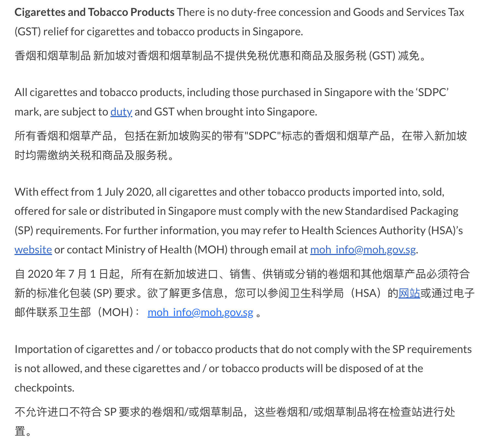

- [新加坡政府官网](https://www.ica.gov.sg/enter-transit-depart)
- # [旅客通关程序](https://www.ica.gov.sg/enter-transit-depart/entering-singapore)
	- ## 签证办理
		- 查看护照有效期
		- SGAC card 办理，提前 3 天，在 MyICA mobile上申请。申请前准备护照、酒店、机票信息
	- ## 公共卫生要求
		- 有病及时申报
	- ## 报关要求
		- 如果==您进入新加坡的商品==超过了[商品和服务税 （GST）、进口减免和/或免税优惠](http://www.customs.gov.sg/individuals/going-through-customs/arrivals/duty-free-concession-and-gst-relief/)，请在抵达前 [Customs@SG Web 应用程序](http://m.customs.gov.sg/customstravellerportal)进行报关和缴税。有关海关申报和纳税的更多信息，请参阅[行李清关/双通道系统](https://www.ica.gov.sg/enter-transit-depart/at-our-checkpoints/for-travellers/baggage-clearance)。
			- 
		- 确保您不要携带==[违禁物品](https://www.ica.gov.sg/enter-transit-depart/entering-singapore/what-you-can-bring)==进入新加坡。
			- 
		- 在红色通道申报所有==[应课税品、管制物品或违禁品](https://www.ica.gov.sg/enter-transit-depart/entering-singapore/what-you-can-bring/prohibited-controlled-dutiable-goods)==。
			- 
		- ==现金==申报要求
			- 如果您进入新加坡时携带的总价值超过 ==20,000 新元==（或等值外币）的现金类物品，请进行[实物货币和不记名可转让票据 （CBNI） 申报](https://www.ica.gov.sg/redirect-links/SPF-Submit-Cash-(CBNI)-Declaration-e-727)。有关现金类物品申报的更多信息，请参阅[将现金带入和退出新加坡](https://www.ica.gov.sg/enter-transit-depart/at-our-checkpoints/for-travellers/CBNI)。